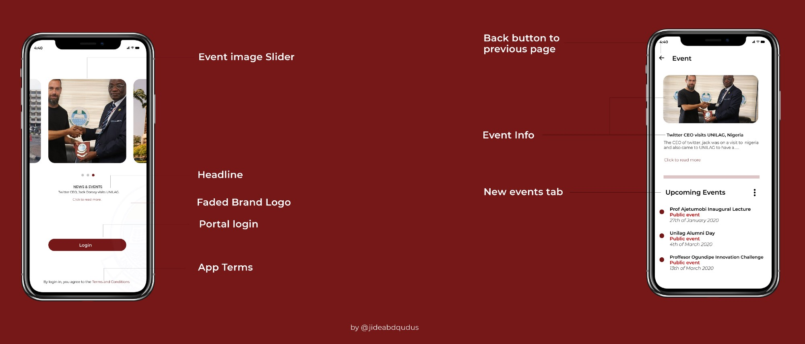

## The Brief 

The `UI/UX` of this app is concentrated on the experiences of users of the `lag mobile app` available on the google play store.
The App is a mobile application that helps to solve the problems experienced with navigating constantly through the school's website. It offers university students an opportunity to get first-hand information and access to there database/portal.

## Project Brief

An interactive mobile application prototype that can solve the problem of searching, navigating, downloading and filtering information in a convenient way and analyze the UI/UX progress through iterations all along the design process through proper `design thinking` strategies.

## The Design Process

As this work serves as a personal project and away from my normal core software programming, I thought to create a good UX strategy based on knowledge sought around.

## Interviews/Reviews 
To start this process I took reviews from students, coworkers, and end-users of the application to understand important areas that needed to be worked on.

Based on the survey and interview research, the results indicated that:

-  ### Users want options for updating data

- ### Users want to have time to use

- ### Users want flexibility in making payments

- ### Users want real-time information feed.

## Affinity Mapping

Subsequently, I started identifying the user’s `preferences` and `pain-points`. Once I did that, I wrote them down and grouped them in an affinity map which helped me pinpoint recurrent themes and issues. I selected the most recurrent themes or problems from the reviews to be the focal points of the mobile application.

## User Flow

Before `wireframing` and creating a `high-fidelity prototype`, I decided to create a simple user flow in Figma. With this, I was able to better understand how the user would interact with the app to perform the tasks needed.

 

## Low-Fidelity Wireframes

Right after finishing the User Flow, I was ready to start prototyping my low fidelity wireframes of the app on paper.

 

## Visual Design/Prototype

For this part of the process, I was able to transform the paper frameworks into high-fidelity prototypes.

 

## High-Fidelity Prototype

User guide into the High-fidelity prototype, with a thorough look at the functions/pathways.

 

## Conclusion 

Working on this project has been a great experience and I have learned about the `user-centered design` process in great detail. Understanding the UX process through a user-centered lens allows for designing apps/websites with the user in mind by understanding the motivations and desires of each user.

 

## Readers feedback

After reading several UX case studies, seeking to find the perfect methodology, `I realized that nobody’s project reaches perfection` and I’m pretty sure that mine is not the exception.
For this reason, I’d really really love to have feedback from you guys whether it is on my methodology, my writing or any other thing you think I should improve.
Thanks a lot in advance for the feedback and for your reading!

I’ll leave you with extra images from the project :)

 

  

