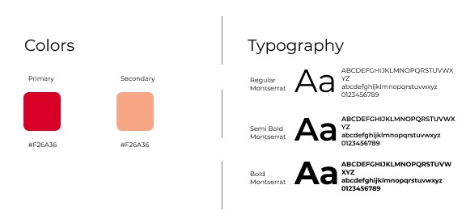
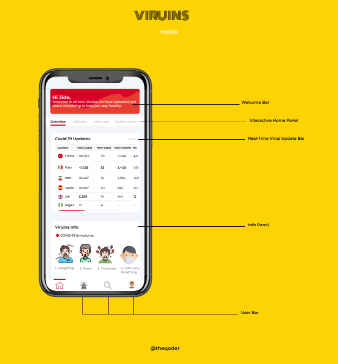

## Brief 

In the early 2000s, the average human had an attention span of 42seconds, by 2019; `the average human now has an attention span of 8secs` that’s 1 second less than that of a goldfish. Every modern Website/Application makes use of Colors, Motion animations with exquisite Interfaces to get users to interact more and stay tuned on the website.

The concept of the Viruins UI is to blend interactive motion designs with modern Health Technologies leveraging the use of Colors, and Motion to keep the user interested in the application.

## The design Process

Unlike previous works, this UI was rendered without any prior UX research to generate the result. Regardless, it qualifies as an impressive body of work as no particular project reaches perfection.

## Visual Design 

In an attempt to attract as many users as possible, I took my time to learn and understand what it means to have a strong visual design, making sure that the visuals are as good as possible. I worked on a style guide, and onboarding illustrations to assist with this.

1.  The use of a Cold tone to establish an overall sense of tranquility that is necessary to help users concentrate on the more important features of the app.

2. White is often used as the background of apps because it represents reverence, purity, innocence, and nothingness. This association calms people and influences their brain activity in a very positive way.

3. Red/Pink is the color of childhood, tenderness, sensitivity, romance, and health. It is often associated with being taken care of and with babies and mothers, which is why it’s primarily used for designing platforms related to women’s health, childbirth, and Health care.

4. Fonts are another invaluable part of the app’s design. They’re like your business card, your outfit, or the way you style your hair — they represent who you are and what you do. I used a Serif font for this design.

5. Other things I considered are the size of the buttons ( as the average width of an adult fingertip is 10mm ), Interline spacing, Icons e.t.c.

 

## Conclusion

Working on this project has been a great experience and I have learned about the user-centered design process and motion design in great detail. It has also given me the ability to understand how effective colors could be in User Interaction amongst other things.

 

 

Thanks a lot in advance for the feedback and for your reading!

