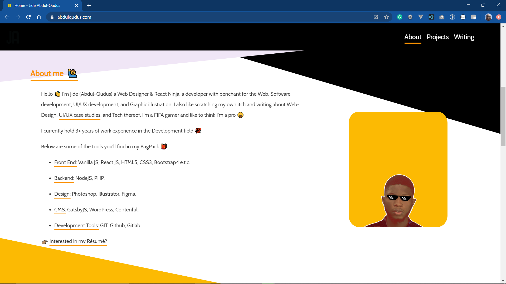
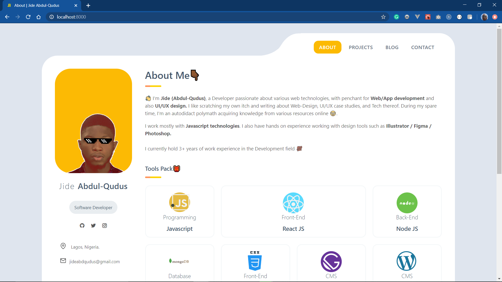

I launched my web protfolio 27th of April, (My birthday coincidentally ahah 🤔), While i had so many impressive reviews and I loved the look because it depicted just what i wanted, color and life in the Front End development. 

I migrated to my new page few months later, why?

## exPage ? 

It was amazing building this page as it served as the building block for Gatsby JS for me, while my previous site used [Contenful](https://www.contenful.com) infrastructure, I wanted an even more dynamic approach to my website and inclusion of more features, Reducing white space was also a factor -  I wanted to utilize every space on the pages. 

Are you lost? Keep reading..

## What is Contentful ?

Contentful is `content infrastructure`. The platform lets you create, manage and distribute content to any platform. Unlike a CMS, It gives you total freedom to create your own content model so you can decide which content you want to manage, providing RESTful APIs so you can deliver your content across multiple channels such as websites, mobile apps (iOS, Android and Windows Phone) or any other platform you can imagine.

## Then What's Gatsby ?

Gatsby is a static page generator that takes data from various data sources and produces `graphql` API's that can be consumed by the frontend and once the build is taken the static pages are generated for the dynamic data. More over it's a framework built on top of `ReactJS` that takes care of lot of challenges while building `react` application. The most common data source that I use is transforming the markdowns into graphql data using the `gatsby-transformer-remark` plugin. Gatsby can also take data from sources like Wordpress and other CMS like drupal, contentful, etc. In short Gatsby’s data plugin ecosystem lets you build sites with the data you want — from one or many sources: get data from SaaS services, headless CMSs, APIs, databases, your file system, and more directly into your pages using GraphQL .

You basically need to understand React to Use Gatsby.

## Why I migrated to my new home?

1.  ### Performance in mind

    The first reason was keeping the performance of my web application in mind. Since gatsby is a single page application and serves mostly statically generated pages the performance is quite good with minimal deployment charges. Gatsby also optimizes the images that it serves. It also takes care of `prefetch` and `preload` of data.

2. ### I'm a developer

    I'm a developer, I build stuffs, I learn, I practice. 

3. ### Blogging

    While my previous page got articles from my Github through the API calls, I'm more comfortable writing the markdowns for my blog which is dynamic and interesting.

4. ### SEO is also taken care of

    One important thing for me was branding my name `jide abdul-qudus` over the internet. For this all the factors of SEO had to be taken care which is a bit challenging. Since gatsby renders static pages the performance is good, which enhances the `SEO` as well. There are plugins for SEO in gatsby. Server-Side-Rendering (`SSR`) is also supported by gatsby.

## Building yours

There are plenty of different ways to build gatsby websites. To start with you can look into official [gatsby docs](https://www.gatsbyjs.org/docs/) and the tutorials on their [site](https://www.gatsbyjs.org/tutorial/). There are also a list of [plugins](https://www.gatsbyjs.org/plugins/) that can help you to develop your site faster. For more comparision about Wordpress with Gatsby you can check this [link](https://www.gatsbyjs.org/features/cms/). You can go through the starters which are available over the internet. I have also open-sourced my website [abdulqudus.com](https://abdulqudus.com) on my [Github page](https://github.com/jideabdqudus/abdulqudus.com2). Please make sure you give a star for this repo. Much thanks to `rolwin reevan` for this.

